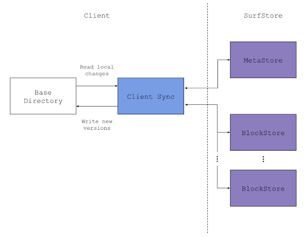
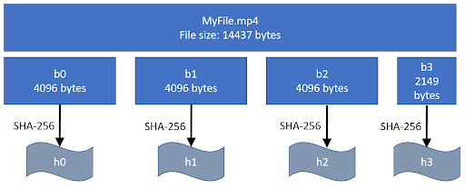
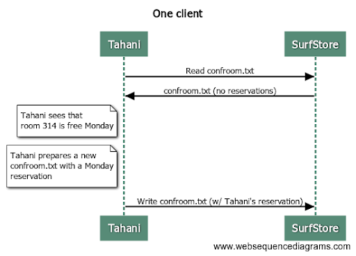
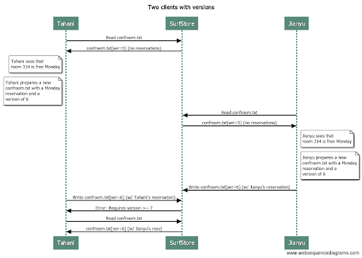

# Fault Tolerant SurfStore

## Overview



This project creates a cloud-based file storage service called SurfStore. SurfStore is a networked file storage application that is based on Dropbox, and lets you sync files to and from the “cloud”. This project implements the cloud service, and a client which interacts with the service via gRPC.

Multiple clients can concurrently connect to the SurfStore service to access a common, shared set of files. Clients accessing SurfStore “see” a consistent set of updates to files, but SurfStore does not offer any guarantees about operations across files, meaning that it does not support multi-file transactions (such as atomic move).

The SurfStore service is composed of the following two services:

| | |
|---|---|
|BlockStore| The content of each file in SurfStore is divided up into chunks, or blocks, each of which has a unique identifier. This service stores these blocks, and when given an identifier, retrieves and returns the appropriate block.|
|MetaStore| The MetaStore service manages the metadata of files and the entire system. Most importantly, the MetaStore service holds the mapping of filenames to blocks. Furthermore, it should be aware of available BlockStores and map blocks to particular BlockStores.  In a real deployment, a cloud file service like Dropbox or Google Drive will hold exabytes of data, and so will require 10s of thousands of BlockStores or more to hold all that data. |

## Fundamentals

This section goes over some of the fundamentals of SurfStore: blocks, files, and versioning. 

### Blocks, hashes, and hashlists

A file in SurfStore is broken into an ordered sequence of one or more blocks. Each block is of uniform size (defined by the command line argument), except for the last block in the file, which may be smaller (but must be at least 1 byte large). As an example, assume the block size is 4096 bytes, and consider the following file:



The file ‘MyFile.mp4’ is 14,437 bytes long, and the block size is 4KB. The file is broken into blocks b0, b1, b2, and b3 (which is only 2,149 bytes long). For each block, a hash value is generated using the SHA-256 hash function. So for MyFile.mp4, those hashes will be denoted as [h0, h1, h2, h3] in the same order as the blocks. This set of hash values, in order, represents the file, and is referred to as the hashlist. Note that if you are given a block, you can compute its hash by applying the SHA-256 hash function to the block. This also means that if you change data in a block the hash value will change as a result. To update a file, you change a subset of the bytes in the file, and recompute the hashlist. Depending on the modification, at least one, but perhaps all, of the hash values in the hashlist will change.

### File and Directories

#### Files and Filenames
Files in SurfStore are denoted by filenames, which are represented as strings. For example “MyDog.jpg”, “WinterVacation.mp4”, and “Expenses.txt" are all examples of filenames. SurfStore doesn’t have a concept of a directory or directory hierarchy–filenames are just strings. For this reason, filenames can only be compared for equality or inequality, and there are no “cd” or “mkdir” commands. Filenames are case sensitive, meaning that “Myfile.jpg” is different than “myfile.jpg”. Filenames can contain spaces, but as described below, cannot contain commas ‘,’ or the forward slash ‘/’, and cannot be named index.db.

#### Base Directory

A command-line argument specifies a “base directory” for the client. This is the directory that is going to be synchronized with the cloud-based service. Client will upload files from this base directory to the cloud, and download files (and changes to files) from the cloud into this base directory. Client should not modify any files outside of this base directory. Note in particular the client should not download files into the “current” directory, only the base directory specified by that command line argument.  This base directory will contain zero or more files, but won’t have any subdirectories.

### Versioning

#### File Versions

Each file/filename is associated with a version, which is a monotonically increasing positive integer. The version is incremented any time the file is created, modified, or deleted. The purpose of the version is so that clients can detect when they have an out-of-date view of the file hierarchy.

For example, imagine that Tahani wants to update a spreadsheet file that tracks conference room reservations. Ideally, they would perform the following actions:



However, another client might be concurrently modifying this file as well. In reality, the order of operations might be:


As shown above, Tahani overwrote the change that Jianyu made without realizing it. This problem can be solved with file versions. Every time a file is modified, its version number is incremented. SurfStore only records modifications to files if the version is exactly one larger than the currently recorded version. Let’s see what would happen in the two-client case:



In the above example, both Tahani and Jianyu downloaded identical copies of confroom.txt (at version 5). They then both started editing their local copies of the file. So there was a point where Tahani had “her own” version 6 of the file (with her local changes), and Jianyu had “his own” version 6 of the file (with his local changes). How do we know whose “version 6” is the real version 6?

The answer is that whoever syncs their changes to the cloud first wins. So in this example, Jianyu was first to sync his changes to the cloud, which caused his modifications to the file to become the official version 6 of the file. Later, when Tahani tries to upload her changes, she realizes that Jianyu beat her to it, and so Jianyu’s changes to the file will overwrite her copy.

#### Deleting Files

To delete a file, the MetadataStore service records a versioned “tombstone” update. This update simply indicates that the file has been deleted. In this way, deletion events also require version numbers, which prevents race conditions that can occur when one client deletes a file concurrently with another client deleting that file. Note that this means that a deleted file must be recreated before it can be read by a client again. If a client tries to delete a file that has already been deleted, that is fine–just handle the version numbers of these tombstone updates appropriately.

To represent a “tombstone” record, the file’s hash list is set to a single hash value of “0” (a string with one character which is the 0 character).

### Block Store Service

The BlockStore server stores the contents of each block of data, indexed by its hash value. It supports basic get and put operations. It does not need to support deleting blocks of data–we just let unused blocks remain in the store. The BlockStore service only knows about blocks–it doesn’t know anything about how blocks relate to files.

The service implements the following API:

| | |
|---|---|
|PutBlock(b) | Stores block b in the key-value store, indexed by hash value h |
|b = GetBlock(h)|Retrieves a block indexed by hash value h|
|HasBlocks(hashlist_in)|Given an input hashlist, returns an output hashlist containing the subset of hashlist_in that are stored in the key-value store|
|GetBlockHashes()|Returns a list containing all block hashes on this block server|

### Meta Store Service

The service implements the following API:

| | |
|---|---|
|GetFileInfoMap()|Returns a mapping of the files stored in the SurfStore cloud service, including the version, filename, and hashlist.
|UpdateFile()|Updates the FileInfo values associated with a file stored in the cloud. This method replaces the hash list for the file with the provided hash list only if the new version number is exactly one greater than the current version number. Otherwise, one can send version=-1 to the client telling them that the version they are trying to store is not right (likely too old).|
|GetBlockStoreMap()|Given a list of block hashes, find out which block server they belong to. Returns a mapping from block server address to block hashes. |
|GetBlockStoreAddrs()|Returns all the BlockStore addresses.|

## Algorithm

### Basic Operating Theory

When a client syncs its local base directory with the cloud, a number of things must be done to properly complete the sync operation.

The client should first scan the base directory, and for each file, compute that file’s hash list. The client should then consult the local index file and compare the results, to see whether (1) there are now new files in the base directory that aren’t in the index file, or (2) files that are in the index file, but have changed since the last time the client was executed (i.e., the hash list is different).

Next, the client should connect to the server and download an updated FileInfoMap. For the purposes of this discussion, let’s call this the “remote index.”

The client should now compare the local index (and any changes to local files not reflected in the local index) with the remote index. A few things might result.

First, it is possible that the remote index refers to a file not present in the local index or in the base directory. In this case, the client should download the blocks associated with that file, reconstitute that file in the base directory, and then add the updated FileInfo information to the local index.

Next, it is possible that there are new files in the local base directory that aren’t in the local index or in the remote index. The client should upload the blocks corresponding to this file to the server, then update the server with the new FileInfo. If that update is successful, then the client should update its local index. Note it is possible that while this operation is in progress, some other client makes it to the server first, and creates the file first. In that case, the UpdateFile() operation will fail with a version error, and the client should handle this conflict as described in the next section.

### Handling Conflicts

The above discussion assumes that a file existed in the server that wasn’t locally present, or a new file was created locally that wasn’t on the server. Both of these cases are pretty straightforward (simply upload or download the file as appropriate). But what happens when there is some kind of version mismatch, as described in the motivation at the top of this specification? That is described in this subsection.

Imagine that for a file like cat.jpg, the local index shows that file at version 3, and we compare the hash list in the local index with the file contents, and confirm that there are no local modifications to the file. We then look at the remote index, and see that the version on the server is larger, for example 4. In this case, the client should download any needed blocks from the server to bring cat.jpg up to version 4, then reconstitute cat.jpg to become version 4 of that file, and finally the client should update its local index, bringing that entry to version 4. At this point, the changes from the cloud have been merged into the local file.

Consider the opposite case: the client sees that its local index references cat.jpg with version 3. The client compares the hash list in the local index to the file contents, and sees that there are uncommitted local changes (the hashes differ). The client compares the local index to the remote index, and sees that both indexes are at the same version (in this case, version 3). This means that we need to sync our local changes to the cloud. The client can now update the mapping on the server, and if that RPC call completes successfully, the client can update the entry in the local index and is done (there is no need to modify the file’s contents in the base directory in this case).

Finally, we must consider the case where there are local modifications to a file (so, for example, our local index shows the file at version 3, but the file’s contents do not match the local index). Further, we see that the version in the remote index is larger than our local index. What should we do in this case? Well, we follow the rule that whoever syncs to the cloud first wins. Thus, we must go with the version of the file already synced to the server. So we download any required blocks and bring our local version of the file up to date with the cloud version.

### Consistent Hashing
A mapping approach based on consistent hashing is implemented. When the MetaStore server is started, the program creates a consistent hash ring in MetaStore. Since a command line argument including each block server’s address is provided, each block server will have a name in the format of “blockstore” + address (e.g. blockstorelocalhost:8081, blockstorelocalhost:8082, etc). These strings representing the servers are hashed using the same hash function as the block hashes – SHA-256.

Each time a file is updated, the program breaks the file into blocks and computes hash values for each block. Then GetBlockStoreMap is called which returns a map indicating which servers the blocks belong to based on the consistent hashing algorithm. Based on this map, blocks are uploaded to corresponding block servers.

### Fault Tolerance
Because data blocks are immutable and cannot be updated (since doing so would change their hash values, and thus they’d become entirely new blocks), replicating blocks is quite easy. On the other hand, replicating the MetaStore service is quite challenging, because multiple clients can update the Metadata of a file in a concurrent manner. To ensure that the Metadata store is fault tolerant and stays consistent regardless of failures, it can be implemented as a replicated state machine design, which is the purpose of this project.

In this project, SurfStore is made fault tolerant using the [RAFT Protocol](https://raft.github.io/raft.pdf).

A RaftSurfstoreServer is implemented which functions as a fault tolerant MetaStore. Each RaftSurfstoreServer communicates with other RaftSurfstoreServers via GRPC. Each server is aware of all other possible servers (from the configuration file), and new servers do not dynamically join the cluster (although existing servers can “crash” via the Crash api). Leaders will be set through the SetLeader API call, so there are no elections.

Using the protocol, if the leader can query a majority quorum of the nodes, it will reply back to the client with the correct answer. As long as a majority of the nodes are up and not in a crashed state, the clients are able to interact with the system successfully.  When a majority of nodes are in a crashed state, clients block and not receive a response until a majority are restored. Any clients that interact with a non-leader get an error message and retry to find the leader.

## Protoc and Makefile

Generate the protobuf
```console
protoc --proto_path=. --go_out=. --go_opt=paths=source_relative --go-grpc_out=. --go-grpc_opt=paths=source_relative pkg/surfstore/SurfStore.proto
```

Run BlockStore server:
```console
$ make run-blockstore
```

Run RaftSurfstore server:
```console
$ make IDX=0 run-raft
```

Test:
```console
$ make test
```

Specific Test:
```console
$ make TEST_REGEX=Test specific-test
```

Clean:
```console
$ make clean
```
